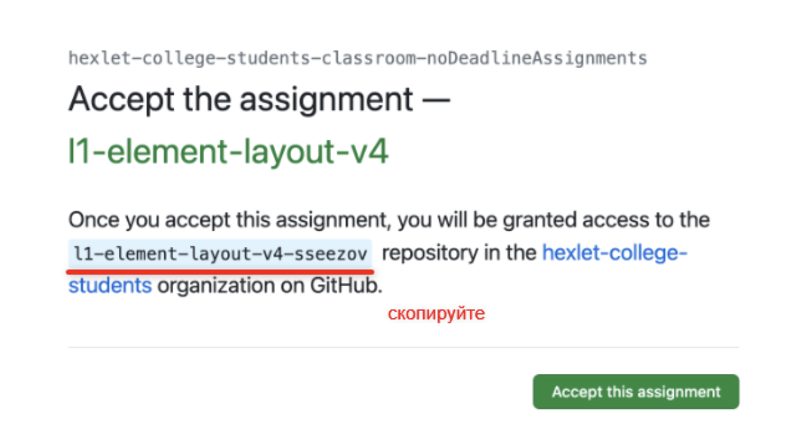

## Как принять задание в гитхаб классрум?

1. Перейдите по ссылке-приглашению
2. Скопируйте имя задания, как указано ниже

3. Примите задание (кнопка "Accept this assignment")

4. Если вы увидели ошибку доступа: "Repository access issue. You no longer have access to your assignment repository. Contact your teacher for support", то перейдите по следующему адресу в браузере: https://github.com/orgs/hexlet-college-students/[скопированное имя задания], в случае как на скриншоте это будет https://github.com/orgs/hexlet-college-students/l1-element-layout-v4-sseezov
   
6. Клонируйте репозиторий и выполняйте работу

Также вам на почту должно прийти письмо от гитхаба со ссылкой на доступ к репозиторию, можете перейти по ссылке в письме и получить доступ к заданию таким образом.

Ошибка доступа происходит из-за бага в системе гитхаб классрум. Студент видит ошибку доступа, хотя репозиторий доступен по прямой ссылке или при переходе по письму на почте.

Если у вас все равно не получается перейти в репозиторий, то обратитесь к куратору или к Сергею Сизову в системе мудл колледжа, объясните проблему и пришлите свой никнейм на гитхабе.
